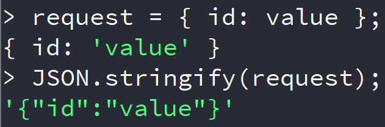
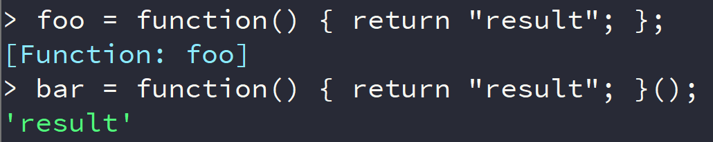

# Lab instructions (1/3)

## Getting to know the target

1. Check out the Globomantics Take Me Out web application in your browser, which
   can be found at `http://tmo/`.

   Open a web browser and visit http://tmo/

   Look at the web application, and see whether you can figure out what the
   application server is supposed to do. This is usually the first step,
   understanding the "Happy Path".

:grey_question: **Question**: What do you think the `/request` endpoint expects?

2. You can close the browser window, as we won't be needing it anymore during
   our lab. Open up another terminal window, and rearrange both terminal windows
   in such a way, that both are visible. One shows the `nest` log file, and
   another to actually perform the attack with. This will help you 'debug' the
   attack.

3. In the new terminal window, check whether you can access the `tmo` site using
   `curl`: Perform a simple get request and specify the `-v` flag to ensure that
   verbosity is on.

```bash
curl -v http://tmo/
```

:blue_book: **Note**: If you want, you can also view the logs of the `tmo`
server using `sudo docker logs tmo`. In real-world scenarios you don't have the
luxury of seeing server debug messages, so be sure to make the best of it now!

4. Apparently, the ticketing server expects JSON objects on the endpoint
   `/request`. The object also needs to have an `id` and `description`
   attribute. Let's perform a simple POST request of a JSON object using curl:

```bash
curl --data '{"id":"1","description":"text"}' http://tmo/request
```

:grey_question: **Question**: Can you see why this doesn't seem to work?

5. The application type is not specified correctly. You can verify this by
   adding the `-v` parameter to the `curl` command.

```bash
curl -v --data '{"id":"1","description":"text"}' http://tmo/request
```

When using the `--data` parameter, `curl` will use the FORM post content type by
default. That's not what the application server is expecting. You can set or
override headers using the `-H` or `--header` parameter.

Perform the same request, but now by specifying the correct header.

```bash
curl --data '{"id":"1","description":"text"}' -H 'Content-Type: application/json' http://tmo/request
```

6. Great! The server parses, or deserializes our JSON object into a JavaScript
   object. JSON is a serialization format, which is often used for sending and
   storing JavaScript objects.

   Let's create our own JavaScript object, convert it to JSON, and send it to
   the server.

:blue_book: **Note**: JSON, or JavaScript Object Notation is a data format using
the JavaScript syntax. Keys as well as values are surrounded by double quotes.

Using the command `node` we can execute NodeJS statements on the command line
using a Read-Evaluate-Print Loop, or REPL. Start the `node` REPL with the
command `node`.

```bash
node
```

:blue_book: **Note**: You can always exit the REPL using Control-D

Within the `node` REPL, create a `request` object. When not using the `var`
keyword, the value will be printed automatically.

```js
value = "value";
request = { id: value };
```

Serialize this object into the JSON format, using the `JSON.stringify` function.

```js
JSON.stringify(request);
```



See the contrast between the JSON format and JavaScript objects?

With JavaScript objects, only string values are surrounded by single quotes, and
keys don't need quotes. Within the JSON format, keys as well as values are
surrounded by double quotes.

Close the `node` REPL using Control-D

Send this serialized object as POST data to the endpoint `http://tmo/request`,
and ensure that the `id` is properly parsed. Don't worry about the
`description`.

```bash
curl --data '{"id":"value"}' -H 'Content-Type: application/json' http://tmo/request
```

Can you see that our original JavaScript object is parsed correctly?

## Finding a vulnerability

7. Now we're able to serialize JavaScript objects, and send them to the
   Globomantics Take Me Out server, where they are being parsed.

   The deserialization process of applications often contains vulnerabilities.
   Hence, let's see whether the `tmo` application performs insecure
   deserialization.

   First, what would happen if we would serialize a JavaScript **function**
   instead of a string ? In order to do that, let's use the external
   `node-serialize` library instead of the built-in `JSON` functions like
   `JSON.stringify`.

   Start the `node` REPL again using `node`, and let's serialize an object with
   a function as value.

```js
serialize = require("node-serialize");

// Define a function
value = function () {
  return "result";
};
// Set the key id to contain the function
request = { id: value };

// Let's see if we still can execute the function
request["id"]();

// And now serialize our object
serialized = serialize.serialize(request);
```

See the result? This is a serialized function. You can deserialize it using the
`unserialize` function, and execute the function:

```js
serialize.unserialize(serialized);
serialize.unserialize(serialized)["id"]();
```

So, using the `node-serialize` module, we can serialize functions. Awesome!

:blue_book: **Note**: If you can't import the `node-serialize` function
(**MODULE_NOT_FOUND**), ensure that the `NODE_ENV` variable for the current user
is set:

```bash
export NODE_ENV=/usr/local/lib/node_modules
```

After having set that, restarting the `node` REPL should give you access to that
library. `node-serialize` is installed as a global package.

9. So what if we would combine that with the power of Immediately Invoked
   Function Expressions? If, after defining a function, you add opening and
   closing ellipses, the function will be immediately executed after its
   definition. Let's see this in action in the `node` REPL:

```js
// Define a function
foo = function () {
  return "result";
};

// Use an Immediately Invoked Function Expression
bar = (function () {
  return "result";
})();
```

See the difference between the two definitions?



The function defined in `bar` will immediately be executed, and `bar` will be
set to the **result** of the function. In other words, a function can be
**executed**, if you're able to define it. This is where insecure
deserialization comes into play: If you would be able to pass a serialized
function definition to a deserialization function, then the deserialization
process could immediately execute that function.

Exit the `node` REPL using Control-D

10. Now, in a shell, send the serialized object as data to the server, and
    observe what happens:

```bash
curl --data '{"id":"_$$ND_FUNC$$_function(){return(\"result\")}"}' -H "Content-Type: application/json" http://tmo/request
```

:grey_question: **Question**: Is this what you expected?

Now, try to modify the `curl` command, so that it executes the function on the
server `tmo`, and sets the value of the `id` key to `result`: That would mean we
are able to exploit an insecure deserialization vulnerability.

See for the solution and continuation of the lab [Solution 1](Solution_1.md)
